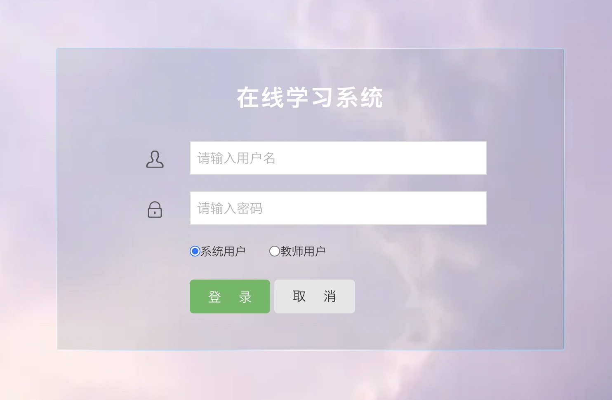

## 基于SSM实现的在线学习系统(程序+报告)

- <b>完整代码获取地址：从戎源码网 ([https://armycodes.com/](https://armycodes.com/))</b>
- <b>技术探讨、资料分享，请加QQ群：692619798</b> 
- <b>作者微信：19941326836  QQ：952045282</b> 
- <b>承接计算机毕业设计、Java毕业设计、Python毕业设计、深度学习、机器学习</b>
- <b>选题+开题报告+任务书+程序定制+安装调试+论文+答辩ppt 一条龙服务</b>
- <b>所有选题地址 ([https://github.com/YuLin-Coder/AllProjectCatalog](https://github.com/YuLin-Coder/AllProjectCatalog)) </b>

## 项目介绍
基于SSM实现的在线学习系统，项目分为学生、老师、管理员3个角色，主要功能如下

在线学习系统有以下功能，帮我根据以下功能画出系统总体工作流程图

1.前台功能模块
前台首页、新闻公告、教学通知、教师信息、留言交流、学生注册、学生登陆、个人中心、我的课程、我的成绩、在线测试、我的错题集、教学视频等功能。
2.后台管理模块
后台系统登陆、管理员信息管理、学生信息管理、教师信息管理、院系信息管理、班级信息管理、课程信息管理、课程章节管理、网站公告管理、测试题管理、学生成绩管理、视频课件管理、学生留言管理、留言交流管理等功能。

## 项目技术
- 编程语言：Java
- 数据库：MySQL
- 前端技术：JSP、jQuery、H-ui
- 后端技术：Spring、SpringMVC、MyBatis

## 运行环境
- JDK版本：JDK1.8及以上
- 开发工具：IDEA、Ecplise、Myecplise都可以
- 数据库: MySQL5.7及以上

## 运行截图

